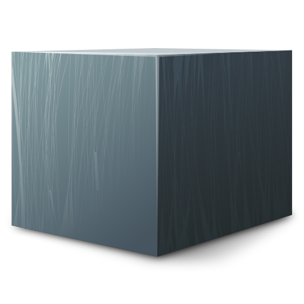

# IronCompress

 [](https://www.nuget.org/packages/IronCompress)

 C++ compression methods joined together in one native library, cross-compiled for multiple architectures and exposed as a .NET library. .NET has built-in support for Gzip and Brotli (which is what this library is using) but other compression methods are either available only as native libraries hard (impossible for some) to consume, or ill-ported C# alternatives. In fact, I myself [wrote one of them](https://github.com/aloneguid/IronSnappy). Using native, original implementations is the way to go if you want to keep performance, security, and features up to date.

The library supports the following formats:

- [Google Snappy](http://google.github.io/snappy/) [[source](https://github.com/google/snappy)].
- [Facebook's Zstandard (zstd)](https://facebook.github.io/zstd/) [[source](https://github.com/facebook/zstd)].
- [Gzip](https://www.gnu.org/software/gzip/) [[source](https://docs.microsoft.com/en-us/dotnet/api/system.io.compression.gzipstream?view=net-6.0)].
- [Google Brotli](https://github.com/google/brotli) [[source](https://docs.microsoft.com/en-us/dotnet/api/system.io.compression.brotlistream?view=net-6.0)].
- [LZO](http://www.oberhumer.com/opensource/lzo/) [[source](https://github.com/nemequ/lzo)].
- [LZ4](https://lz4.github.io/lz4/) [[source](https://github.com/lz4/lz4)].

And following architectures:

|      | Windows     | Linux | Mac OSX |
| ---- | ----------- | ----- | ------- |
| x64  | ✅           | ✅     | ✅       |
| x32  | coming soon | ⛔     | ⛔       |
| ARM  | coming soon | ✅     | ✅       |

The library periodically updates to the latest binaries. All the binaries are compiled from C/C++ source with CMake for major systems i.e. Linux, Windows and MacOSX. They are then wrapped safely with a .NET interface.

## Using

This library *only compresses buffers*. It may work with streams in the future, but I am currently only interested in buffers. Essentially, you pass `ReadOnlySpan<byte>` as an input, and receive `Span<T>` as an output in the most efficient way.

Here is an example of how to compress buffer with *snappy* codec:

```csharp
using IronCompress;	// root namespace

// Construct library entry point and optionally pass an implementation of ArrayPool.
// I will pass default shared pool here.
var iron = new Iron(ArrayPool<byte>.Shared);

byte[] input = ...;
using(Result compressed = iron.Compress(Codec.Snappy, input.AsSpan()))
{
    // ... use data
}
```

`Compress`and `Decompress` methods actually return a `Result` class which wraps byte array of compression or decompression operation. You can access the underlying result by calling to `.AsSpan()` method inside the result. On dispose, `Result` makes sure the underlying memory is freed up - if pooling was used, it will be returned back to the pool.

To decompress:

```csharp
using (Result uncompressed = iron.Decompress(Codec.Snappy, compressed, input.Length))
{
	// ... use data
}
```

As with compression, this returns `Result` with decompressed data. It's worth nothing one important difference - decompression needs the length of output buffer specified as third parameter (`input.Length`). Although some decompressors can guess uncompressed length more or less correct, the others won't know it beforehand. In reality this problem is solved by using a framing format that adds metadata about resulting length, however many compression formats do not define that and consider compressed packets to be implementation specific.

You will need more or less recent C++ compiler, `CMake` and `.NET SDK 6` to build the code.


## Building

See [workflow file](.github/workflows/ci.yml) for building instructions. To develop locally, you might want to download the latest artifact from Actions output and put it into `native/bin` so you have binaries for all platforms.

